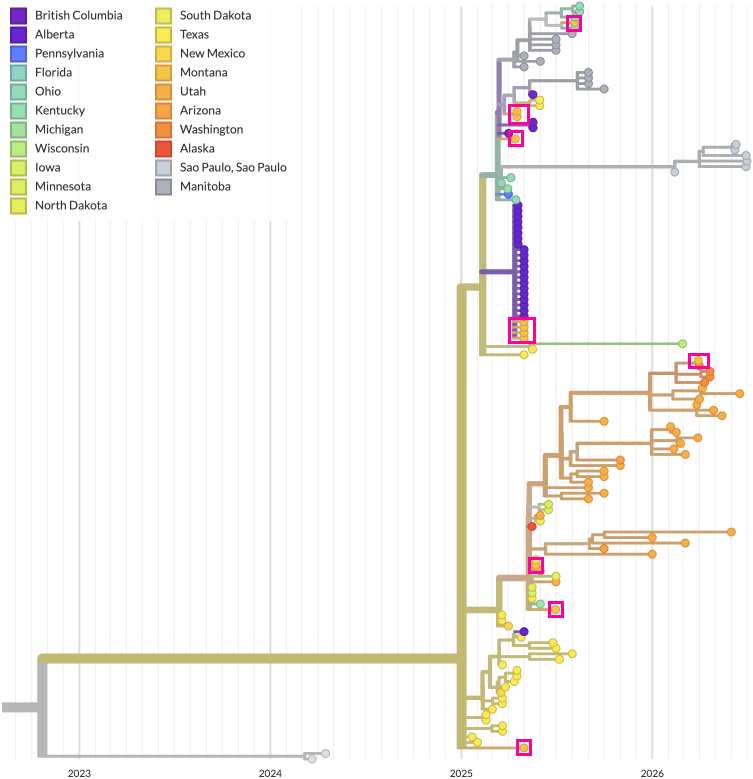
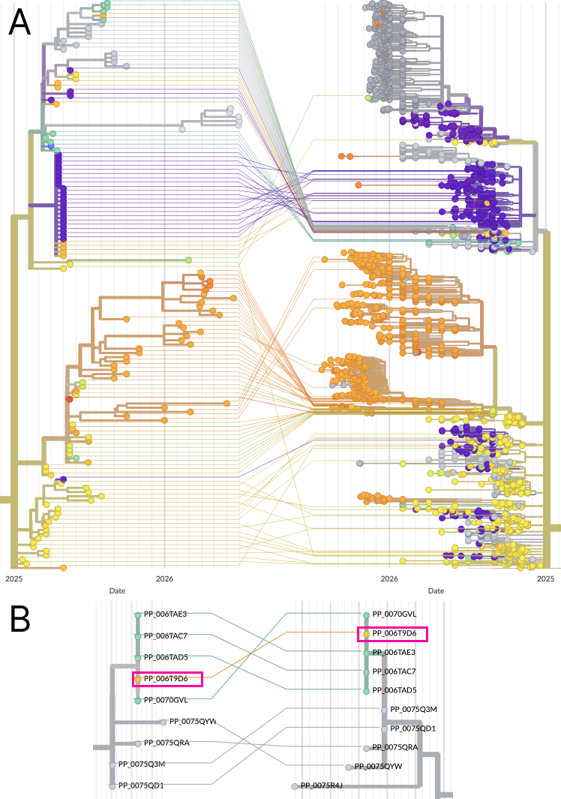

====================
Proximal subsampling
====================

This page uses the North American 2025-26 Measles outbreak as an example to demonstrate the utility of proximal subsampling.
For an introduction to proximal subsampling in Nextstrain please see our `proximal subsampling blog post <https://nextstrain.org/blog/2026-08-19-proximal-subsampling>`_.
This page builds on concepts introduced in :doc:`./filtering-and-subsampling`.

Our `nextstrain/measles <https://github.com/nextstrain/measles>`_ pathogen repo currently includes three phylogenetic analyses: "N450/global", "genome/global" and "genome/north-america".
Within the repo is `an example of using proximal subsampling <https://github.com/nextstrain/measles/tree/main/phylogenetic/custom-analyses/north-america-outbreak-example>`_ which we will follow here.
It uses both open and `restricted Pathoplexus data <https://pathoplexus.org/about/terms-of-use/restricted-data>`_ to focus on the Montana (USA) measles cases and place them in the context of the wider North American outbreak.

.. contents:: Table of Contents
   :local:
   :depth: 2

Prerequisites
-------------

1. The nextstrain CLI (``nextstrain``) installed with a working runtime; minimum version: 10.0.0. See `Installing Nextstrain <https://docs.nextstrain.org/en/latest/install.html>`_ for more details.
2. The latest version of the measles pathogen repo installed / updated, via ``nextstrain setup measles`` or ``nextstrain update measles``.
3. Create an empty analysis directory for the tutorial. All commands below assume we are in this analysis directory.

Configuring the analysis
------------------------

This tutorial uses analysis directories separate to the pathogen repo itself (you may want to read `the nextstrain run documentation <https://docs.nextstrain.org/projects/cli/en/stable/commands/run/>`_ for background context).
Two files are needed to customise the canonical measles workflow: ``config.yaml`` and ``auspice_config.json``.

We can fetch them either by copying / downloading them from GitHub: `config.yaml <https://raw.githubusercontent.com/nextstrain/measles/refs/heads/main/phylogenetic/custom-analyses/north-america-outbreak-example/config.yaml>`_ and `auspice_config.json <https://raw.githubusercontent.com/nextstrain/measles/refs/heads/main/phylogenetic/custom-analyses/north-america-outbreak-example/auspice_config.json>`_, or by fetching them via:

.. code-block:: sh

    curl --compressed https://raw.githubusercontent.com/nextstrain/measles/refs/heads/main/phylogenetic/custom-analyses/north-america-outbreak-example/config.yaml -o config.yaml
    curl --compressed https://raw.githubusercontent.com/nextstrain/measles/refs/heads/main/phylogenetic/custom-analyses/north-america-outbreak-example/auspice_config.json -o auspice_config.json

    
The most important of these is the ``config.yaml``, which is `worth reading in full <https://github.com/nextstrain/measles/blob/main/phylogenetic/custom-analyses/north-america-outbreak-example/config.yaml>`_ to see how it configures the workflow.
We will focus on the subsampling configuration and walk through each of the four samples.

.. code-block:: yaml

    subsample:
        genome/north-america-outbreak-example:
            samples:
                genotype-d8:
                    exclude_where:
                        - "genotype_ppx!=D8"
                    exclude: dropped_strains.txt
                    drop_sample: true
                background:
                    context_sample: genotype-d8
                    max_sequences: 500
                    group_by:
                        - region
                        - year
                montana-outbreak:
                    context_sample: genotype-d8
                    min_date: "2025-01-01"
                    exclude_where:
                        - "division!=Montana"
                nearest-strains:
                    method: hamming
                    focal_sample: montana-outbreak
                    context_sample: genotype-d8
                    k: 20
                    ignore_missing_data: all

The first sample, "genotype-d8", filters the entire dataset to the D8 genotype `which is the genotype involved in the North American outbreak <https://next.nextstrain.org/measles/genome>`_; it has the ``drop_sample`` flag set, indicating the sample does not become part of the output but is used by other samples.

The second sample, "background", is a common sampling approach in our workflows where we sample across geography and time.
Here, we use the sequences from the "genotype-d8" sample to group by geographic region & year and randomly sample up to 500 sequences.
In this case, because the distribution of samples across region & year is very unequal, we sample far less than 500.

The third sample, "montana-outbreak", isolates all the D8 Montana samples from 2025/26.
These will be used as the focal set for our proximal sampling in order to understand the state's samples in a wider context; this approach may mirror what a state's Departments of Health would do for routine surveillance.
How you choose your focal set is dependent on the research question - another common approach would be to merge private data with publicly available data as part of the workflow and then have the private data be your focal set.
As of July 2026, this focal set has 12 genomes.

The fourth sample, "nearest-strains", is the one which uses `proximal sample options <https://docs.nextstrain.org/projects/augur/en/latest/usage/cli/subsample.html#proximal-sample-options>`_ to find the 20 closest sequences for each of the focal strains from across all available D8 genotype samples.
Note that this doesn't mean we'll find 20 sequences for each focal sequence.
There may be overlap, where the same sequence is close to multiple Montana sequences, which is common in outbreaks.
There may not be 20 samples which meet the maximum-distance threshold (not specified here, so using the default of 4).

``augur subsample`` will then merge all samples together except those we instructed it to drop.
Our analysis will consist of background sequences, the small set of samples from Montana, and the samples that are genetically closes to the Montana sequences.
The final dataset size is only 194 genomes - deliberately small to explore the advantages that proximal sampling can provide.

Running the analysis
--------------------

With the two configuration files in your (otherwise empty) analysis directory, we can run the analysis via:

.. code-block:: sh

    nextstrain run measles phylogenetic .

When completed, the analysis is available in the ``auspice/`` directory.
You can either drag these JSONs onto `auspice.us <https://auspice.us>`_ or use ``nextstrain view auspice`` to open a browser tab.
You should see a tree similar to Figure 1.

------------

    **Figure 1.**
    The phylogenetic tree produced by this tutorial. Montana samples (i.e. those from the "montana-outbreak" yaml config block) are highlighted.

------------

Comparing the small tutorial tree with only 136 North American genomes vs our current full North American dataset (Figure 2A) shows that while we have far fewer samples we accurately capture the surrounding context for Montana samples (Figure 2B).
(In reality, 136 samples is tiny, and usages beyond an example tutorial should use denser sampling.)

------------

    **Figure 2.**
    (**A**) Zoomed in view of the tutorial tree's n=136 North American genomes (LHS) vs a more comprehensive analysis showing n=1992 North American D8 genomes (RHS); horizontal axis represents time.
    The full tree is the measles workflow's "genome/north-america" build.
    (**B**) Zoomed in view into a part of the trees with a Montana sample (highlighted in pink boxes).
    Horizontal axis here represents divergence.

