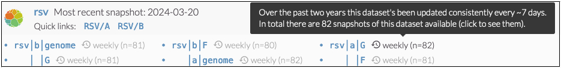
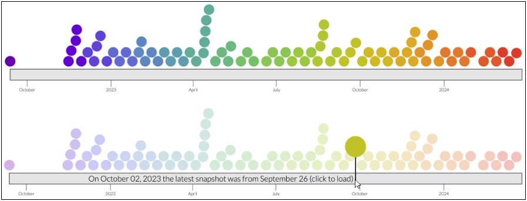
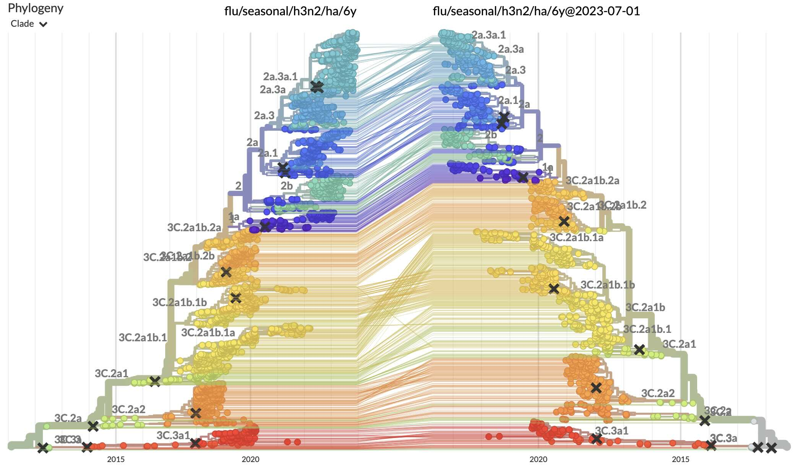
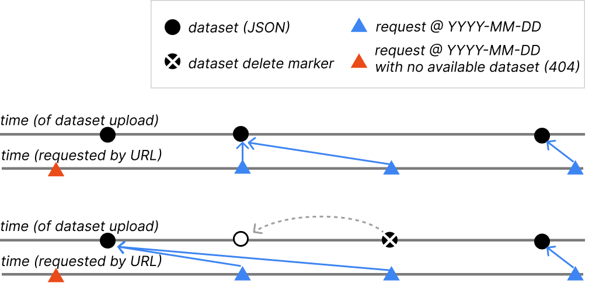

=========================
Viewing previous analyses
=========================

.. contents:: Sections in this document
  :local:
  :depth: 2

Overview
========

Analyses are a snapshot in time, and for most of our `core Nextstrain datasets
<https://nextstrain.org/pathogens>`__ we update this snapshot frequently,
sometimes daily. When you view a dataset such as the seasonal influenza build
`flu/seasonal/h3n2/ha/6y <https://nextstrain.org/flu/seasonal/h3n2/ha/6y>`__ you
can see in the header of the page that it's been updated sometime in the last
week or so. Because we update this every week, we have a large archive of past
updates which we can go view; if we want to view the snapshot from mid way
through 2023, we can load `flu/seasonal/h3n2/ha/6y@2023-07-01
<https://nextstrain.org/flu/seasonal/h3n2/ha/6y@2023-07-01>`__, which will load
the latest available snapshot on July 1st, which was a dataset updated on June
30.

In general, appending a ``@YYYY-MM-DD`` string to a Nextstrain core dataset URL
will load the dataset that was the latest available at that particular date.

.. note::

  This functionality is currently only available for core Nextstrain datasets.

Viewing all available (core) resources and their snapshots
==========================================================

`nextstrain.org/pathogens <https://nextstrain.org/pathogens>`__ lists all
available core datasets grouped by pathogen, as well as exposing all the known
snapshots for each resource. Next to each resource you'll see the total number
of available snapshots as well as an indication of how frequently the dataset is
updated, for instance at the time of writing `nextstrain.org/rsv/a/G <https://nextstrain.org/rsv/a/G>`__
had 82 snapshots and was being updated weekly:

Clicking on the dataset name, e.g. ``rsv|a|G`` in the above image, will always
load the latest available dataset.

To view the available snapshots, click on the update frequency/number text to
bring up a view similar to the top-half of the following screenshot:

Here each coloured circle represents an available snapshot, and we can hover
over each to view the date it was uploaded and click to view the dataset itself.
Perhaps a simpler way to explore the data is to move your mouse over the grey
bar, as shown in the lower panel of the screenshot. This will indicate which
dataset was the latest available at the date you're currently hovering over, and
you can click at any time to load that dataset.

Additional information
======================

Tanglegrams to compare changes
------------------------------

Using tanglegrams allows us to easily view two different snapshots of the same
dataset side-by-side. Using the above examples we can view the latest dataset
against the one from the middle of 2023 via the URL
`flu/seasonal/h3n2/ha/6y:flu/seasonal/h3n2/ha/6y@2023-07-01
<https://nextstrain.org/flu/seasonal/h3n2/ha/6y:flu/seasonal/h3n2/ha/6y@2023-07-01>`__.
Here's a screenshot of this taken in early January 2024, allowing us to see the
expansion of clade 2a.3a.1 over the past 6 months:

Over time, the data shown by this URL link will start to change as we update the
latest snapshot, but by dating both datasets we can preserve this exact view
into the data:
`flu/seasonal/h3n2/ha/6y@2024-01-03:flu/seasonal/h3n2/ha/6y@2023-07-01
<https://nextstrain.org/flu/seasonal/h3n2/ha/6y@2024-01-03:flu/seasonal/h3n2/ha/6y@2023-07-01>`__.

SARS-CoV-2 datestamped datasets
-------------------------------

Prior to the functionality described here we exposed dated snapshots of some of
our datasets by including the YYYY-MM-DD in the URL without the ``@`` character,
i.e. the date string was part of the dataset name. This functionality is now
superseded by the new URL syntax described here, and we may stop producing these
kinds of dated dataset names in the future.

As an example, and to highlight an improvement with the new approach, you can
access the ``ncov/gisaid/21L/global/6m`` SARS-CoV-2 build from Jan 9th 2024
using either the new (and preferred) syntax
`ncov/gisaid/21L/global/6m@2024-01-09
<https://nextstrain.org/ncov/gisaid/21L/global/6m@2024-01-09>`__ or
`ncov/gisaid/21L/global/6m/2024-01-09
<https://nextstrain.org/ncov/gisaid/21L/global/6m/2024-01-09>`__. If we now look
at Jan 10th, when we didn't update the data, we see that
`ncov/gisaid/21L/global/6m@2024-01-10
<https://nextstrain.org/ncov/gisaid/21L/global/6m@2024-01-10>`__ still works
(returning the latest dataset availbale at that time) while
`ncov/gisaid/21L/global/6m/2024-01-10
<https://nextstrain.org/ncov/gisaid/21L/global/6m/2024-01-10>`__ doesn't exist
(404).

Details for dataset maintainers
===============================

.. note::

  This section is more technical and aimed primarily at those managing datasets.

Time zones
----------

All times are UTC. A datestamp refers to datasets uploaded between 00h00
and 23h59 UTC on that day.

S3 Delete Markers
-----------------
Our core datasets are all stored in a versioned S3 bucket, which is how we are
able to provide this functionality. When files are "deleted" from a versioned
bucket, the normal behaviour is to preserve the file but add a `delete marker
<https://docs.aws.amazon.com/AmazonS3/latest/userguide/DeleteMarker.html>`__.
When looking back at versions over time, we interpret the intended behaviour of
a delete marker as removing the then-latest file from history, so it won't be
available via any ``@YYYY-MM-DD`` value.

What about if the URL changed over time?
----------------------------------------

We've often changed the URL which (core) datasets appear at, for instance we
recently changed the URL for `dengue/denv1
<https://nextstrain.org/dengue/denv1>`__ to `dengue/denv1/genome
<https://nextstrain.org/dengue/denv1/genome>`__, with the former now redirecting
to the latter. We group the datasets behind these various URLs together to
present a consistent history of dataset updates. You can access these snapshots
using old or new URLs, the browser will simply be redirected to the current URL
we are using.

Multiple datasets uploaded on the same day
------------------------------------------

If multiple datasets are uploaded on the same day we take the most recent. If
there are v1 and v2 Auspice dataset JSONs then we will always take the v2
dataset over the v1 dataset.

Sidecar files
-------------

Sidecar files must have been uploaded on the same day as the dataset JSON (or
meta+tree JSONs in the case of v1 datasets).

How far back does this go?
--------------------------

The oldest dataset snapshot `is a H3N2 dataset from August 2018
<https://nextstrain.org/flu/seasonal/h3n2/ha/3y@2018-08-01>`__. While Nextstrain
datasets existed before then, we didn't have versioning enabled.
