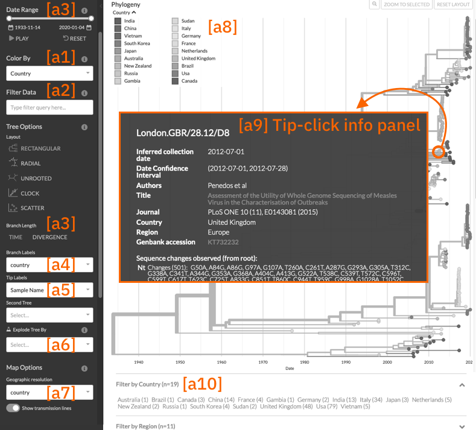
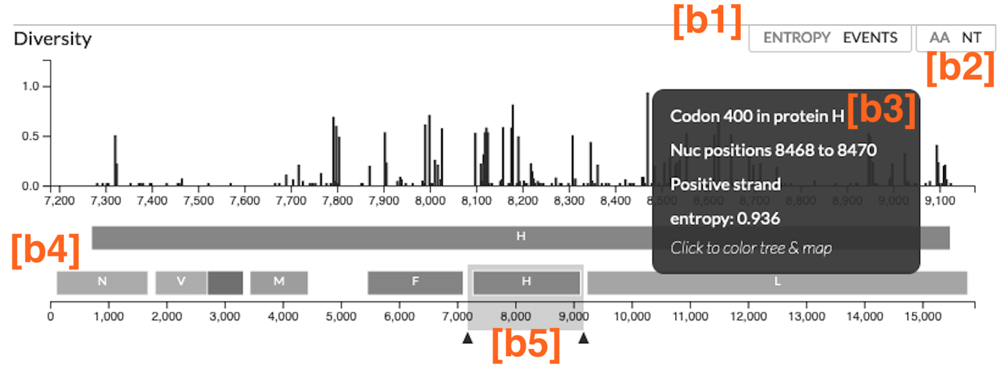

==========================================================
How data is exported by Augur for visualisation in Auspice
==========================================================

This page is intended to describe which data underpins the different parts of
an Auspice visualisation, and how this data can be produced and exported via Augur. It is
not a comprehensive guide for how to generate the data in the first place, nor
how to interpret them in Auspice, but it should help understand how to export
your data and how to customize the visualization.

This guide is based on Auspice version 2.39 and Augur version 18.0.0. We
will endeavour to keep this up-to-date however if you are using newer
versions it may pay to check the `Auspice
changelog <https://github.com/nextstrain/auspice/blob/master/CHANGELOG.md>`__
or the `Augur changelog <https://github.com/nextstrain/augur/blob/master/CHANGES.md>`__
for any salient changes.

.. contents:: Sections in this document
  :local:
  :depth: 2

Auspice (visualization) components
==================================

It's helpful to start in Auspice and then work backwards to Augur.
In this section, we will walk through various components of Auspice and how
they relate to the :term:`dataset JSON <phylogenetic dataset>` (sometimes called an Auspice JSON).

Phylogeny Tree Panel and Core Controls
--------------------------------------

We'll use the following annotated screenshot of the `measles virus
tree <https://nextstrain.org/measles>`__ (built using `this Augur
pipeline <https://github.com/nextstrain/measles>`__) to introduce the
various components of the phylogeny tree panel and the core controls:

Generally, data is defined on individual tree nodes in this dataset JSON
via ``node.node_attrs`` (dictionary) or ``node.branch_attrs`` (dictionary).
Dataset-wide metadata such as color scales are typically defined within the
top-level ``meta`` (dictionary). The best place to really understand the data
structures is `the JSON schema <https://nextstrain.org/schemas/dataset/v2>`__
however as an illustrative example we can look at `the data structure behind the tip
highlighted in the screenshot above <https://nextstrain.org/measles?s=London.GBR/28.12/D8>`__:

.. code-block:: json

  {
    "name": "London.GBR/28.12/D8",
    "node_attrs": {
      "accession": "KT732232",
      "url": "https://www.ncbi.nlm.nih.gov/nuccore/KT732232",
      "author": {
        "author": "Penedos et al",
        "journal": "PLoS ONE 10 (11), E0143081 (2015)",
        "paper_url": "https://www.ncbi.nlm.nih.gov/pubmed/26569100",
        "title": "Assessment of the Utility of Whole Genome Sequencing of Measles Virus in the Characterisation of Outbreaks",
        "value": "Penedos et al"
      },
      "div": 0.03952195183861181,
      "num_date": {
        "value": 2012.4986338797814,
        "confidence": [2012.4986338797814, 2012.5721716251735]
      },
      "country": {
        "value": "United Kingdom"
      },
      "region": {
        "value": "Europe"
      },
    },
    "branch_attrs": {
      "labels": {
        "aa": "P: S103P; V: S103P"
      },
      "mutations": {
        "P": ["S103P"],
        "V": ["S103P"],
        "nuc": ["A1184G", "T2113C", "G9914A", "C11201T", "A11522C", "C11843T", "A13151T"]
      }
    }
  }

.. _auspice-component-colorings:

[a1] Colorings
~~~~~~~~~~~~~~

The available colorings are defined by ``meta.colorings`` (array of dictionaries),
where each coloring specifies a key which accesses the relevant data in the
``node_attrs``. As well as a key, a title can be specified (which is what the user will see),
as well as information about the scale used.

The :guilabel:`Genotype` coloring is a special case that requires the mutations
to be provided via ``branch_attrs.mutations``. [#f1]_ For Auspice to color the
tree even when mutations are not present, the :ref:`root-sequence sidecar file <data-formats-root-sequence>`
must be provided.

.. _auspice-component-sidebar-filter:

[a2] sidebar data filtering
~~~~~~~~~~~~~~~~~~~~~~~~~~~

Currently the ``node_attrs`` available for filtering are the union of those
defined in ``meta.filters`` (array of strings), strain names (``node.name``)
and mutations (``branch_attrs.mutations``).

.. note::
  We will hopefully change this shortly to include all data defined in
  a ``node.node_attrs``; please see `this GitHub issue <https://github.com/nextstrain/auspice/issues/1251>`__
  to track progress here.

[a3] Temporal display of the tree
~~~~~~~~~~~~~~~~~~~~~~~~~~~~~~~~~

If ``num_date`` is set on *all* nodes (including internal nodes) then the
:guilabel:`TIME` branch metric and the :guilabel:`Date Range` selector is available.
Note that to colour the tree by this a corresponding entry in the colorings is required.
Conversely, for :guilabel:`DIVERGENCE` then ``div`` (cumulative) must be set on all nodes in the tree.

[a4] Branch Labels
~~~~~~~~~~~~~~~~~~

Any keys pair defined in ``node.branch_attr.labels`` (dictionary of strings)
anywhere in the tree will be available in the branch labels dropdown.

[a5] Tip labels
~~~~~~~~~~~~~~~

This uses the same data as colorings, as well as ``node.name`` (“Sample
name”, which is the default labelling).
Note that genotypes (``key: “gt”``) can’t be used as tip labels (future improvement).

[a6] Explode tree choices (experimental)
~~~~~~~~~~~~~~~~~~~~~~~~~~~~~~~~~~~~~~~~

Generally, exploding a tree requires an attribute that is both discrete
and defined across the entire tree. As this feature is still experimental,
we currently use the defined colorings (:ref:`see [a2], above <auspice-component-sidebar-filter>`)
excluding any which use a continuous scale and excluding genotypes.
Use this feature with caution — you are responsible for choosing sensible
attributes on which to explode the tree!

[a7] Geographic resolutions
~~~~~~~~~~~~~~~~~~~~~~~~~~~

These are defined via ``metadata.geo_resolutions`` (array of dictionaries) in
the same format as colorings, and thus an optional “title” may be specified.
The key should correspond to both ``node_attrs`` (on some or all nodes).
Each of the values in the tree (associated with this key) should have a
corresponding latitude and longitude defined under ``demes`` in this dict.

The “Show transmission lines” toggle will only appear if the attribute
is defined on internal nodes (as well as terminal nodes).

.. note::
  This has no effect on the tree, unlike all other blocks described here.

[a8] Legend Swatches
~~~~~~~~~~~~~~~~~~~~

For a given coloring (:ref:`see [a1], above <auspice-component-colorings>`) the
set of values observed for this coloring across the tree is displayed as a
swatch. This is responsive — only the currently in view part of the tree is
considered, so as you filter the data and zoom the tree the swatches will update.
For continuous and temporal scales, the values are grouped into bins
automatically (unless specified in the scale).

[a9] What's shown when clicking on a node?
~~~~~~~~~~~~~~~~~~~~~~~~~~~~~~~~~~~~~~~~~~

For the selected node Auspice displays the following information, as
applicable:

1. Strain name, as defined by ``node.name``.
2. Vaccine information (``node.node_attrs.vaccine``), if applicable.
3. Sample date (``node.node_attrs.num_date``) as well as any associated
   confidence values. For internal nodes this is always labelled as
   “Inferred date”; terminal nodes are labelled as “Inferred collection
   date” if a non-zero uncertainty range is provided, otherwise
   “Collection date”.
4. Publication info, if provided. This considers ``node_attrs.author``
   (dictionary) and its associated keys ``value``, ``title``,
   ``paper_url``, ``journal`` (only ``value`` is required).
5. Strain information. This considers ``node_attrs.gisaid_epi_isl``,
   ``node_attrs.genbank_accession``, ``node_attrs.accession`` and
   ``node_attrs.url``. [#f2]_
6. Any other ``node_attrs`` provided are displayed. If the attribute is
   also a colouring then the colouring title will be used. Note that
   associated confidence values are not displayed.
7. ``branch_attrs.mutations`` are displayed.

   -  For terminal nodes, we traverse the tree to display the total
      mutations between the root node and this tip. This allows us to
      categorise mutations as “Changes” or “Reversions to root”. Note
      that (e.g.) a series of mutations such as “A -> T -> C” at
      position 100 will be shown as “A100C”.
   -  For internal nodes we show the mutations ascribed to the branch
      but categorise them as “Unique”, “Homoplasies” and “Reversions to
      root”. Note that the first two categories are mutually exclusive
      however a mutation may appear again in the “Reversions to root”
      category, as applicable.

[a10] listed filters in the footer of the page
~~~~~~~~~~~~~~~~~~~~~~~~~~~~~~~~~~~~~~~~~~~~~~

Filters in the bottom of the page are specified by ``meta.filters``
(array of strings). The values should correspond to keys in ``node_attrs``,
and Auspice traverses the tree to find the set of all values.
If a coloring was provided for this key then Auspice will attempt to display
the title rather than the key. Selecting filters here behaves the same was as
sidebar data filtering (:ref:`see [a2], above <auspice-component-sidebar-filter>`).

.. _auspice-component-diversity-panel:

Diversity (Entropy) Panel
---------------------------------

We'll use the following annotated screenshot of the diversity (entropy) panel
of the  `measles virus tree <https://nextstrain.org/measles>`__ (built using
`this Augur pipeline <https://github.com/nextstrain/measles>`__) to introduce the
various components:

The diversity panel is enabled by data in the :term:`dataset JSON <phylogenetic dataset>`.
The top-level ``meta.genome_annotations`` provides the genome annotations
displayed and the individual tree nodes provide the mutations
via ``node.branch_attrs.mutations``, which are used to calculate the entropy
and to count the mutation events.

Gaps in nucleotides (``-``), masked nucleotides (``N``), and unknown amino acids (``X``) are
excluded from the calculations and counts. Only mutations from visible tree
nodes are included in the calculations for the diversity panel, so the entropy values
and event counts will change when you turn on a filter or zoom into a subtree.

.. _auspice-component-diversity-panel-entropy-event-toggle:

[b1] Toggle between Entropy and Events
~~~~~~~~~~~~~~~~~~~~~~~~~~~~~~~~~~~~~~

:guilabel:`ENTROPY` represents normalized `Shannon entropy <https://en.wikipedia.org/wiki/Entropy_\(information_theory\)>`__,
measuring the "uncertainty" inherent in the possible nucleotides or codons
at a given position.

:guilabel:`EVENTS` represent a count of changes in the nucleotide or codon at that
position across the visible tree. Changes **to** and **from** the excluded characters
(``-`` and ``N`` for nucleotides; ``X`` for amino acids) are ignored in the counts.

Mutations are counted by traversing the entire visible tree and adding the
changes provided via ``node.branch_attrs.mutations``. The entropy calculation
is performed within Auspice using these observed mutations and the number of
visible tips with each mutation.

Suppose the tree has the following codons at a single position:

+--------+--------+
| codons | tips   |
+========+========+
| H      | 1378   |
+--------+--------+
| L      | 1      |
+--------+--------+
| P      | 643    |
+--------+--------+
| R      | 1177   |
+--------+--------+
| Total  | 3199   |
+--------+--------+

The entropy calculation for the position would be:

.. math::

  -\frac{1378}{3199} \ln{(\frac{1378}{3199})} - \frac{1}{3199} \ln{(\frac{1}{3199})} - \frac{643}{3199} \ln{(\frac{643}{3199})} - \frac{1177}{3199} \ln{(\frac{1177}{3199})} \approx 1.056

[b2] Toggle between Amino Acids (AA) and Nucleotides (NT)
~~~~~~~~~~~~~~~~~~~~~~~~~~~~~~~~~~~~~~~~~~~~~~~~~~~~~~~~~
Both the entropy and events plots can be toggled between the amino acids (AA)
and nucleotides (NT) views. When set to :guilabel:`AA`, entropy and events are
calculated **per gene** provided via ``meta.genome_annotations.<gene_name>``.
The mutations for the matching ``<gene_name>`` provided via ``node.branch_attrs.mutations.<gene_name>``
are included in the calculations. When set to :guilabel:`NT`, entropy and events
use the nucleotide mutations provided via ``node.branch_attrs.mutations.nuc``.

[b3] What happens when you interact with the bars on the plot?
~~~~~~~~~~~~~~~~~~~~~~~~~~~~~~~~~~~~~~~~~~~~~~~~~~~~~~~~~~~~~~
Hovering over a vertical bar will bring up an information panel that displays:

1. Codon position within the gene and nucleotide position within the sequence.

  * In the :guilabel:`AA` view, the codon position is based on the mutation position
    provided in ``node.branch_attrs.mutations.<gene_name>``. The nucleotide
    positions are calculated using the codon position, the ``meta.genome_annotations.<gene_name>.start``
    value, and the ``meta.genome_annotations.<gene_name>.end`` value.
  * In the :guilabel:`NT` view, the nucleotide position is based on the mutation
    position provided in ``node.branch_attrs.mutations.nuc``. If the nucleotide
    position is within a gene in the ``meta.genome_annotations``, then the codon
    position is calculated using the nucleotide position, the ``meta.genome_annotations.<gene_name>.start``
    value, and the ``meta.genome_annotations.<gene_name>.end`` value.

2. If the bar is within a gene, the information panel will include whether it's
   positive or negative strand from the description provided in
   ``meta.genome_annotations.<gene_name>.strand``.
3. Entropy or events value calculated for in view tree nodes as
   described :ref:`above <auspice-component-diversity-panel-entropy-event-toggle>`.

Clicking on a vertical bar will change the :ref:`coloring <auspice-component-colorings>`
to color by :guilabel:`Genotype`. In the :guilabel:`AA` view,
colors will be set to genotype at the codon site of the gene. In the :guilabel:`NT` view,
colors will be set to genotype at the nucleotide position.

[b4] Genome Annotations
~~~~~~~~~~~~~~~~~~~~~~~
The x-axis shows the nucleotide positions and the genome annotations with one-based
starting positions. The lower x-axis shows the entire genome with all provided
genome annotations from the top-level ``meta.genome_annotations``. The upper
x-axis shows a view of the currently zoomed in section of the genome.

[b5] Zoom in the plot
~~~~~~~~~~~~~~~~~~~~~
By default, the diversity panel shows the entire genome. Users can drag either
side of the grey box to zoom into specific sections of the genome.
For example, the annotated image shows a zoomed in view of the hemagglutinin (H) gene.
The grey box can also be dragged across the x-axis to zoom into a different
section of genome while preserving the zoomed length. This zoomed view
cannot be set within the dataset JSON, but it can be set with the
`URL parameters <https://docs.nextstrain.org/projects/auspice/en/stable/advanced-functionality/view-settings.html#url-query-options>`_
``gmin`` and ``gmax``.

--------------

Exporting data via Augur
========================

We now consider how information flows through Augur, specifically
``augur export v2`` which produces the :term:`dataset (Auspice) JSON <phylogenetic dataset>`
described above.  This process combines data inputs with parameters configuring
aspects of the visualisation and produces :term:`dataset files <phylogenetic dataset>` for
Auspice to visualise.

.. graphviz::
    :align: center

    digraph {
        graph [
            rankdir=LR,
            ranksep=0.25,
        ];

        node [
            shape=box,
            style="rounded, filled",
            fontname="Lato, 'Helvetica Neue', sans-serif",
            fontsize=12,
            height=0.1,
            colorscheme=paired10,
        ];

        edge [
            arrowhead=open,
            arrowsize=0.75,
        ];

        inputs [
            shape=record,
            label="Data inputs|"
                 +"- tree (Newick, required)\l"
                 +"- metadata TSV\l"
                 +"- node-data JSONs\l"
                 +"- colors TSV\l"
                 +"- lat-longs TSV\l",
            fillcolor=9,
            color=10,
        ];

        config [
            shape=record,
            label="Configuration|"
                 +"- Auspice config JSON\l"
                 +"- command-line arguments\l",
            fillcolor=7,
            color=8,
        ];

        augur [label="augur export v2", fillcolor=1, color=2];
        auspice [label="Auspice", fillcolor=3, color=4];
        dataset [label="Dataset JSONs"];

        inputs -> augur [headport=nw];
        config -> augur [headport=sw];
        augur -> dataset -> auspice;
    }

This guide will explain the functionality using an **Auspice config
JSON**, usually named ``auspice_config.json``, to control which data is exported and how it is presented in Auspice,
however it is possible to use command-line arguments to specify
a subset of this configuration instead; please run ``augur export v2 --help``
to see the available options here.
The most comprehensive description of this file is via
`its schema <https://nextstrain.org/schemas/auspice/config/v2>`__, however to
introduce this file here's a snippet of the `Auspice config JSON for the
measles dataset presented above <https://github.com/nextstrain/measles/blob/main/config/auspice_config.json>`__:

.. code-block:: json

  {
    "title": "Real-time tracking of measles virus evolution",
    "colorings": [
      {"key": "num_date", "title": "Date", "type": "continuous"},
      {"key": "country", "title": "Country", "type": "categorical"}
    ],
    "geo_resolutions": ["country", "region"],
    "display_defaults": {
      "map_triplicate": true
    },
    "filters": ["country", "region"]
  }

What metadata is exported
-------------------------

Augur has two main types of “metadata” which we'll refer to as
“TSV-data” (provided with the ``--metadata`` argument) and “node-data”
which are JSONs provided via ``--node-data`` (see :doc:`data formats </reference/data-formats>` for more).
Typically, node-data information is automatically exported as a coloring whereas
TSV-data must be explicitly exported by requesting it as a coloring in the
auspice-config JSON. [#f3]_ Metadata is exported as a coloring if via the
following process:

-  All key-value pairs specified in node-data JSONs, unless they match a
   hardcoded-list of exclusions and special-cases (next section). This
   has the effect that data provided in node-data JSONs will form a
   coloring and thus be exported in the dataset JSON.
-  Command-line provided colorings (not covered in this guide)
-  Colorings specified in the ``auspice_config.json`` (see below)

Metadata keys ``<X>_entropy`` (numeric) or ``<X>_confidence`` (dictionary),
assuming key ``<X>`` exists, will be combined into the same ``node.node_attrs.X`` data structure.
Auspice uses the entropy value to influence the saturation of the color and
the confidence data is shown when hovering / clicking on the branch/node.

Special cases (keys which are excluded or behave differently)
-------------------------------------------------------------

To maintain backwards compatibility a number of keys are excluded or
special-cased here and should be treated with caution. If you need to
check a particular key you can search for it `in the
code <https://github.com/nextstrain/augur/blob/master/augur/export_v2.py>`__,
but currently these keys include:

- any key which ends with ``_confidence`` or ``_entropy`` (see previous section)
- ``annotations``, ``aa_muts`` and ``muts`` (see :ref:`How branch mutations are
  exported <auspice-config-branch-mutations-and-diversity-panel>`, below)
- ``mutation_length`` and ``branch_length`` are converted to the tree’s
  divergence values [#f4]_ and exported as ``node.div`` (float); with the
  first matching key being used. This is optional — time only trees are
  just fine.
- key ``hidden`` is only exported if its value is one of
  “always”, “divtree”, “timetree”. We don't cover this behavior here, and
  it is somewhat experimental, so try it out first!
- key ``clade_membership`` gets the title ``Clade`` (unless you provide one)
- key ``num_date`` (numerical date) gets the title ``Sampling Date``
  (unless you provide one) and type ``continuous``
- key ``author`` gets the title ``Authors`` (unless you provide one) and the
  exported data structure will incorporate any of the following metadata keys:
  ``journal``, ``authors``, ``title`` and ``paper_url``. [#f5]_ In effect,
  this means that none of these keys are available to be a coloring
  themselves (apart from ``author``).
- Some keys are deprecated & changed on-the-fly: ``author`` → ``authors`` and
  ``numdate`` → ``num_date``
- key ``gt`` gets the title ``Genotype``; this is
  automatically created if annotations are defined (see :ref:`How branch
  mutations are exported <auspice-config-branch-mutations-and-diversity-panel>` section below)
  but you can supply your own title if you like.
  Note that metadata provided under the key ``gt`` may be exported, but it
  won't actually be used by Auspice!
- ``clade_membership`` is converted to a branch label, see :ref:`Branch
  Labels <auspice-config-branch-labels>` section below.
- ``vaccine`` must be a dictionary with special keys (via a node-data JSON);
  see the `the dataset schema <https://nextstrain.org/schemas/dataset/v2>`__
  for full details. Auspice uses this to render crosses over certain tips in the
  tree. This means that ``vaccine`` cannot be a coloring itself.
- The following keys are typically ignored: ``date``, ``raw_date``,
  ``clock_length``, ``sequence``, ``aa_sequences``, ``dTiter``, ``dTiterSub``.
  If you wish to export them then you must specify them in your auspice config.

How conflicting metadata is resolved
------------------------------------

Node-data JSONs are combined using a deep-merge approach, where we
recurse into dictionaries. For non-dictionary values we will overwrite
previously seen values, so the order of JSONs provided matters! The
information for each node is then added to the per-node (per-strain)
TSV-data, with the node-data being used in the case of duplicate keys.
As a contrived example:

.. code-block:: js

   // node-data file 1
   nodes: {NODE_NAME: {country: "USA", region: "North America"}}
   // node-data file 2
   nodes: {NODE_NAME: {country: "Canada"}}
   // metadata TSV
   {NODE_NAME: {country: "Mexico", serotype: "ABC"}}
   // resulting merged metadata
   nodes: {NODE_NAME: {country: "Canada", region: "North America", serotype: "ABC"}}

Configuring coloring names and types
------------------------------------

The colorings in the auspice-config JSON typically link the key (where the
metadata is to be found) to a title (how the key is to be presented in Auspice)
and a type (how should the color scale be constructed).
Setting the type to one of “continuous”, “temporal”, “ordinal”, “categorical”
or “boolean” lets Auspice use the appropriate color scale.
If the type is not provided, it will be inferred in this order:

#. "boolean" if all values are within ``["false", "true", "1.0", "0.0", "1", "0", "yes", "no"]``.
#. "continuous" if all values are numeric.
#. "categorical" if none of the above are satisfied.

The provided colorings in the auspice-config JSON will result in corresponding
metadata being exported. As mentioned above, for node-data provided metadata
this is not necessary, but if in doubt it's safest to provide this information
in the auspice-config JSON.

Configuring color scales and legends
------------------------------------

A colors TSV file may be provided to ``augur export v2`` which is the
most common way to associate (discrete) values with actual colors. Such
a file has 3 tab-separated columns: the coloring key, the metadata
value, and the color hex; no headers are necessary. As an example, `here
are (some of) the colors TSV <https://github.com/nextstrain/measles/blob/main/config/colors.tsv>`__
used in the measles build:

.. code-block:: text

   region  oceania #88BB6C
   region  west asia   #ADBD51
   region  africa  #CEB541
   region  europe  #E39B39

See :doc:`the guide on custom trait colors </guides/bioinformatics/colors>` for more details on how to use the colors TSV.

Augur itself provides `a default set of colors <https://github.com/nextstrain/augur/blob/master/augur/data/colors.tsv>`__,
currently only for “region”. This means that if you don't specify any colors
for region then we'll use the defaults, however if you specify *any* colors for
“region” in the TSV then the defaults won't be used (i.e. there is no merging).

This is all optional - if you don't provide colors then Auspice will use
the provided scale type and create a suitable scale for you. Remember that if
you define any colors, then you should define them all (for that coloring) -
any metadata values you don't provide colors for will be shown in greyscale!

You can instead define which colors are used in the auspice-config JSON;
this is a bit more involved but provides greater flexibility.
For discrete scales, you can link individual values to color hex codes
(similarly to the colors TSV approach, values not listed here will use a
greyscale in Auspice) or for continuous scales by linking pivot points
to colours which Auspice will interpolate between to create the final scale.
Separate to the color definitions you can limit what values are present in the
legend and how they are displayed. For full details please see `the
schema <https://nextstrain.org/schemas/auspice/config/v2>`__ but the
following example may illustrate what's possible:

.. code-block:: json

  "colorings": [
    {
      "key": "num_date",
      "title": "Date (custom colors)",
      "type": "continuous",
      "scale": [
        [2000, "#edf8b1"], [2020, "#7fcdbb"], [2022, "#2c7fb8"]
      ],
      "legend": [
        {"value": 2010, "display": "<2020", "bounds": [2000, 2020]},
        {"value": 2020.5, "display": "2020", "bounds": [2020, 2021]},
        {"value": 2021.5, "display": "2021", "bounds": [2021, 2022]},
        {"value": 2022.5, "display": "2022", "bounds": [2022, 2023]}
      ]
    },
    {
      "key": "serotype",
      "title": "Serotype",
      "type": "categorical",
      "scale": [
        ["DENV-1", "#781C86"], ["DENV-2", "#83BA70"], ["DENV-3", "#547BD3"], ["DENV-4", "#DF4327"]
      ]
    }
  ],

Finally, nodes with missing or unknown data [#f6]_ are automatically set to
gray in the tree and the “unknown” values will not be present in the color legend.

.. _auspice-config-branch-mutations-and-diversity-panel:

Branch Mutations and Diversity (Entropy) Panel
----------------------------------------------

The branch mutations and the diversity (entropy) panel are enabled by the same
nucleotide mutations, amino acid mutations, and genome annotations provided
via the dataset JSON. The genome annotations are **required** for the
:ref:`diversity panel in Auspice <auspice-component-diversity-panel>`.

If these metadata are available, then a special coloring is created in
the exported dataset JSON: ``{"key": "gt", "title": "Genotype", "type": "categorical"}``
which is used by Auspice to allow coloring by genotype.
You can also define this in the auspice-config JSON if you wish to use a
different title.

Nucleotide Mutations
~~~~~~~~~~~~~~~~~~~~
The nucleotide mutations are assigned to internal nodes via ``augur ancestral``.
The mutations are output to a node-data JSON as ``nodes.<node_name>.muts``.
The node-data JSON is passed to ``augur export v2`` via the ``--node-data`` option
and the nucleotide mutations are exported as ``node.branch_attrs.mutations.nuc``.

See :doc:`augur ancestral <augur:usage/cli/ancestral>` for more details on
how the nucleotide mutations are assigned.

Amino Acid Mutations
~~~~~~~~~~~~~~~~~~~~
The node-data JSON output from ``augur ancestral`` includes the nucleotide sequences
for internal nodes as ``nodes.<node_name>.sequence``, which are passed to ``augur translate``
to translate and generate the amino acid mutations. The mutations are output to
a node-data JSON as ``nodes.<node_name>.aa_muts.<gene_name>``.
The node-data JSON is passed to ``augur export v2`` via the ``--node-data`` option
and the amino acid mutations are exported as ``node.branch_attrs.mutations.<gene_name>``.

See :doc:`augur translate <augur:usage/cli/translate>` for more details on
how the amino acid mutations are generated.

Genome Annotations
~~~~~~~~~~~~~~~~~~
The genome annotations are also generated by ``augur translate``.
The features of the reference sequence, provided via ``--reference-sequence``,
are formatted according to the `annotations schema <https://github.com/nextstrain/augur/blob/master/augur/data/schema-annotations.json>`_
and output to the node-data JSON as ``annotations``. ``augur export v2`` directly exports
these annotations as ``meta.genome_annotations``.

.. _auspice-config-branch-labels:

Branch Labels
-------------

Currently branch labels are unable to be specified beyond two special
cases, and there is no way to customize their appearance via the
auspice-config JSON. We are in the process of improving this.

1. If the key ``clade_annotation`` is present, these are converted to
   the “Clade” branch label (``node.branch_attrs.labels.clade``).
2. If amino acid mutations are defined, then the ``aa`` branch label is
   automatically created.

Geographic resolutions and lat-longs
------------------------------------

The map (geographic) panel in Auspice works by associating certain
metadata with lat-long values. The metadata keys used for this are
called “geographic resolutions”, and are exported if the certain
criteria are met.

The auspice-config JSON should define the ``geo_resolutions`` as a list
of either dictionaries or strings; the former allows more customization
but the latter is much simpler.

Example auspice-config JSON using strings:

.. code-block:: json

  "geo_resolutions": [
    "country",
    "region"
  ]

Example auspice-config JSON using dictionaries:

.. code-block:: json

  "geo_resolutions": [
    {"key": "country", "title": "Custom Country Title"},
    {"key": "region", "title": "Custom Region Title"}
  ]

The specified keys will be exported from the metadata inputs (“country”
and “region”, in the above examples). Finally we need a mapping of the
metadata values, called “demes” (e.g. the individual countries or
regions) to their lat-long values. This is typically provided via a
lat-longs TSV input file, such as:

.. code-block:: text

   region  africa  4.070194    21.824559
   region  china   35.000074   104.999927
   region  europe  49.646237   10.799454

Augur `has some defaults configured for “region”, “country” and
“division” <https://github.com/nextstrain/augur/blob/master/augur/data/lat_longs.tsv>`__
which are merged in with any user-provided data (the latter takes
precedence). We also maintain a very large set of these for our `ncov
build <https://github.com/nextstrain/ncov/blob/master/defaults/lat_longs.tsv>`__
which may be a helpful reference.

If a deme is defined on the tree but no lat-long value is provided then
it will not be shown in Auspice. In these cases ``augur export v2`` will
print a warning.

Specifying which colorings are available as filters
---------------------------------------------------

Select (discrete) colorings are available for filtering in Auspice (both
via the sidebar UI and listed in the footer) if they are defined in the
auspice-config JSONs filters list:

.. code-block::

   "filters": ["country", "region", ...]

Additionally, each mutation and strain name will be automatically
available in Auspice’s sidebar UI for filtering.

.. note::

  This behavior may change in the future; ideally all exported
  metadata should be searchable via Auspice's sidebar filtering UI.

Customizing the Auspice defaults and available panels
-----------------------------------------------------

There are a number of other sections of the auspice-config JSON which
can configure how Auspice presents the exported data.

The **panels** (array, with entries of “tree”, “map”, “frequencies”, “entropy”,
“measurements”) restricts which panels are available to be rendered in Auspice.
By default all panels the dataset supports are available.

The **display_defaults** (dictionary) configures the defaults for many
of Auspice’s UI settings, such as which coloring to use.
Please see `the Auspice documentation <https://docs.nextstrain.org/projects/auspice/en/latest/advanced-functionality/view-settings.html?highlight=display_defaults#dataset-json-configurable-defaults>`__
for a list of these.

The **data_provenance** (list of dictionaries) defines the source of the
data. This is exported as ``meta.data_provenance`` and is rendered by
Auspice at the top of the page.

The **build_url** (string) specifies URL with instructions to reproduce
the build, which is typically a GitHub repo URL. This is used by Auspice
in the page header.

The **maintainers** (array of dictionaries) is used in the Auspice
header to identify who created or maintains the dataset.

As an example, here's how the `measles auspice-config uses these
keys <https://github.com/nextstrain/measles/blob/main/config/auspice_config.json>`__
and you can `see here <https://nextstrain.org/measles>`__ how Auspice
renders these:

.. code-block:: json

  "title": "Tutorial Nextstrain build for Zika virus",
  "maintainers": [
    {"name": "Trevor Bedford", "url": "http://bedford.io/team/trevor-bedford/"}
  ],
  "build_url": "https://github.com/nextstrain/zika-tutorial",
  "panels": [ "tree", "map", "entropy" ],
  "display_defaults": {
    "map_triplicate": true
  }

--------------

.. rubric:: Footnotes

.. [#f1] Mutations defined here should have an associated entry in the
  ``meta.genome_annotations`` (dictionary of dictionaries). Auspice will
  still try to display datasets if this is missing, but functionality will
  be missing.

.. [#f2] If both ``genbank_accession`` and ``gisaid_epi_isl`` are provided,
  then Auspice will display both. Only if neither are provided do we
  consider ``node_attrs.accession`` and ``node_attrs.url``.

.. [#f3] We treat these two sources of information differently because (in
  our experience) users often have sensitive / private data in metadata
  TSVs which they may not wish to export, and conversely node-data only
  exists if it has been computed by a previous step in the workflow and
  therefore most probably wants to be part of the resulting dataset.

.. [#f4] The input is per-branch, however the exported value is cumulative.

.. [#f5] The key of each author is generated by grouping authors and adding
  alphabetical suffixes as necessary. This produces authors “Surname et al
  A” and “Surname et al B” etc.

.. [#f6] Values which aren’t valid are those in the set
  ``["undefined", "unknown", "?", "nan", "na", "n/a", 'none', '', 'not known']``
  (case-insensitive) .
