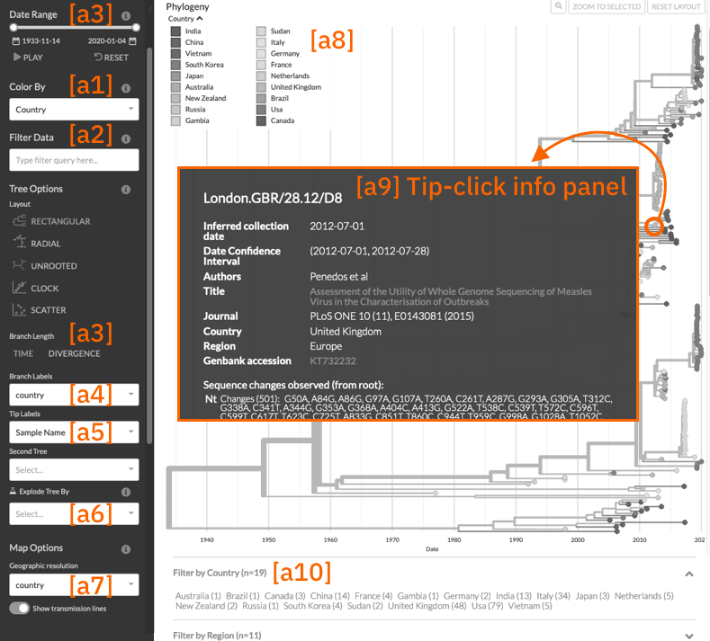

## How data is exported by Augur for visualisation in Auspice

This page is intended to describe which data underpins the different parts of an Auspice visualisation, and how this data can be produced via Augur. It is not a comprehensive guide for how to generate individual pieces of data nor how to interpret them in Auspice.

**Sections in this document:**

* [Auspice (visualisation) components](#auspice-components)
* [Exporting data via Augur](#exporting-data-via-augur)

### Auspice components

It’s helpful to start in Auspice and then work backwards to Augur. The following (annotated) screenshot shows the components of a typical visualisation, which is based on a [dataset JSON (sometimes called an Auspice JSON)](/reference/glossary.html#term-dataset).

This guide is based on Auspice version 2.39. We will endeavour to keep this up-to-date however if you are using a newer version of Auspice it may pay to check the [changelog](https://github.com/nextstrain/auspice/blob/master/CHANGELOG.md) for any salient changes.

We'll use the following annotated screenshot of the [measles virus tree](https://nextstrain.org/measles) (built using [this Augur pipeline](https://github.com/nextstrain/measles)) to introduce the various components:



Generally, data is defined on individual tree nodes in this dataset JSON via `node.node_attrs` (dictionary) or `node.branch_attrs` (dictionary). Dataset-wide metadata such as color scales are typically defined within the top-level `meta` (dictionary). The best place to really understand the data structures is  [the JSON schema](https://nextstrain.org/schemas/dataset/v2) however as an illustrative example we can look at [the data structure behind the tip highlighted in the screenshot above](https://nextstrain.org/measles?s=London.GBR/28.12/D8):

```
{
  "name": "London.GBR/28.12/D8",
  "node_attrs": {
    "accession": "KT732232",
    "url": "https://www.ncbi.nlm.nih.gov/nuccore/KT732232",
    "author": {
      "author": "Penedos et al",
      "journal": "PLoS ONE 10 (11), E0143081 (2015)",
      "paper_url": "https://www.ncbi.nlm.nih.gov/pubmed/26569100",
      "title": "Assessment of the Utility of Whole Genome Sequencing of Measles Virus in the Characterisation of Outbreaks",
      "value": "Penedos et al"
    },
    "div": 0.03952195183861181,
    "num_date": {
      "value": 2012.4986338797814,
      "confidence": [2012.4986338797814, 2012.5721716251735]
    },
    "country": {
      "value": "United Kingdom"
    },
    "region": {
      "value": "Europe"
    },
  },
  "branch_attrs": {
    "labels": {
      "aa": "P: S103P; V: S103P"
    },
    "mutations": {
      "P": ["S103P"],
      "V": ["S103P"],
      "nuc": ["A1184G", "T2113C", "G9914A", "C11201T", "A11522C", "C11843T", "A13151T"]
    }
  }
}
```


##### [a1] Colorings

The available colorings are defined by  `meta.colorings` (array of dictionaries), where each coloring specifies a key which accesses the relevant data in the `node_attrs` [1]. As well as a key, a title can be specified (which is what the user will see), as well as information about the scale used.

##### [a2] sidebar data filtering

Currently the  `node_attrs` available for filtering are the union of those defined in `meta.filters` (array of strings), strain names (`node.name`) and mutations (`branch_attrs.mutations`).

> _We will hopefully change this shortly to include all data defined in a `node.node_attrs`; please see [this GitHub issue](https://github.com/nextstrain/auspice/issues/1251) to track progress here._

##### [a3] Temporal display of the tree

If `num_date` is set on _all_ nodes (including internal nodes) then the “TIME” branch metric and the “Date Range” selector is available. Note that to colour the tree by this a corresponding entry in the colorings is required. Conversely, for “DIVERGENCE” then `div` (cumulative) must be set on all nodes in the tree. 

##### [a4] Branch Labels

Any keys pair defined in `node.branch_attr.labels` (dictionary of strings) anywhere in the tree will be available in the branch labels dropdown.

##### [a5] Tip labels

This uses the same data as colorings, as well as `node.name` (“Sample name”, which is the default labelling). Note that genotypes (`key: “gt”`) can’t be used as tip labels (future improvement). 

##### [a6] Explode tree choices (experimental)

Generally, exploding a tree requires an attribute that is both discrete and defined across the entire tree. As this feature is still experimental, we currently use the defined colorings [(see [a2], above)](#a2-sidebar-data-filtering) excluding any which use a continuous scale and excluding genotypes. Use this feature with caution — you are responsible for choosing sensible attributes on which to explode the tree on! 

##### [a7] Geographic resolutions

These are defined via `metadata.geo_resolutions` (array of dictionaries) in the same format as colorings, and thus an optional “title” may be specified. The key should correspond to both `node_attrs` (on some or all nodes). Each of the values in the tree (associated with this key) should have a corresponding latitude and longitude defined under `demes` in this dict. 

The “Show transmission lines” toggle will only appear if the attribute is defined on internal nodes (as well as terminal nodes).

_Note that this has no effect on the tree, unlike all other blocks described here._

##### [a8] Legend Swatches

For a given coloring (see [a1] above) the set of values observed for this coloring across the tree is displayed as a swatch. This is responsive — only the currently in view part of the tree is considered, so as you filter the data and zoom the tree the swatches will update. For continuous and temporal scales, the values are grouped into bins automatically (unless specified in the scale).

##### [a9] What’s shown when clicking on a node?

For the selected node Auspice displays the following information, as applicable:

1. Strain name,  as defined by `node.name`.
2. Vaccine information (`node.node_attrs.vaccine`), if applicable.
3. Sample date (`node.node_attrs.num_date`) as well as any associated confidence values. For internal nodes this is always labelled as “Inferred date”;  terminal nodes are labelled as “Inferred collection date” if a non-zero uncertainty range is provided, otherwise “Collection date”. 
4. Publication info, if provided. This considers  `node_attrs.author` (dictionary) and its associated keys `value`, `title`, `paper_url`, `journal` (only `value` is required).
5. Strain information. This considers `node_attrs.gisaid_epi_isl`, `node_attrs.genbank_accession`, `node_attrs.accession` and `node_attrs.url` [2].
6. Any other `node_attrs` provided are displayed. If the attribute is also a colouring then the colouring title will be used. Note that associated confidence values are not displayed.
7. `branch_attrs.mutations` are displayed.
    * For terminal nodes, we traverse the tree to display the total mutations between the root node and this tip. This allows us to categorise mutations as “Changes” or “Reversions to root”.  Note that (e.g.) a series of mutations such as “A -> T -> C” at position 100 will be shown as “A100C”. 
    * For internal nodes we show the mutations ascribed to the branch but categorise them as “Unique”, “Homoplasies” and “Reversions to root”. Note that the first two categories are mutually exclusive however a mutation may appear again in the “Reversions to root” category, as applicable.


##### [a10] listed filters in the footer of the page

Filters in the bottom of the page are specified by   `meta.filters` (array of strings). The values should correspond to keys in `node_attrs`, and Auspice traverses the tree to find the set of all values. If a coloring was provided for this key then Auspice will attempt to display the title rather than the key. Selecting filters here behaves the same was as sidebar data filtering (see [a2], above).

---

### Exporting data via Augur

We now consider how information flows through Augur, specifically `augur export v2`  which produces the dataset (Auspice) JSON described above. Augur has two main types of “metadata”  which we’ll refer to as “TSV-data” (provided with the `--metadata` argument) and “node-data” which are JSONs provided via `--node-data` (see [the Data Formats page](/reference/data-formats.html) for more).

At a high level, we combine the provided TSV-data and node-data and then export a subset of this data. This includes certain special keys (e.g. `num_date`) as well as any keys you specify as colorings, filters or geo-resolutions. Typically, node-data information is automatically a coloring whereas TSV-data must be explicitly exported [3]. We’ll now dive into the specifics a bit more!

This guide is based on Augur version 16.0.1. We will endeavour to keep this up-to-date however if you are using a newer version  it may pay to check the [changelog](https://github.com/nextstrain/augur/blob/master/CHANGES.md) for any salient changes.


**How are metadata inputs combined?**

Node-data JSONs are combined using a deep-merge approach, where we recurse into dictionaries. For non-dictionary values we will overwrite previously seen values, so the order of JSONs provided matters! The information for each node is then added to the per-node (per-strain) TSV-data, with the node-data being used in the case of duplicate keys. As a contrived example:

```js
// node-data file 1
nodes: {NODE_NAME: {country: "USA", region: "North America"}}
// node-data file 2
nodes: {NODE_NAME: {country: "Canada"}}
// metadata TSV 
{NODE_NAME: {country: "Mexico", serotype: "ABC"}}
// resulting merged metadata
nodes: {NODE_NAME: {country: "Canada", region: "North America", serotype: "ABC"}}
```

Note that for backwards compatibility, some keys are changed as they are read. Currently `authors → author` and  `numdate → num_date`.

**What are the colorings, filters and geo-resolutions?**

Dataset colorings are created via the combination of:
* All key-value pairs specified in node-data JSONs, unless they match a hardcoded-list of exclusions. This has the effect that data provided in node-data JSONs will form a colouring and thus be exported in the dataset JSON.
* Command-line provided colorings
* Colorings specified in the auspice-config JSON.
* Special cases are automagically added if the provided data support them:
    * `gt` if mutations are defined.
    * `num_date` if dates are defined (on any nodes)
    * `clade_membership` if `clade_membership` or `clade_annotation` are defined on any nodes.
	 
Note that if titles or scale types are not provided (the auspice-config JSON is the only way to provide this information) then we maintain a small list of defaults to use, for instance `num_date` gets the title “Sampling date”. If in doubt, it’s safest to provide this information in the auspice-config JSON.

Filters are defined via either the “filters” section of an auspice-config JSON, or if this is not provided/set, then all non-continuous colorings (except `gt`). 

Geo-resolutions are those set via the command line or via the `geo_resolutions` block of an auspice-config JSON. 

**So… which pieces of metadata are assigned to nodes?**

After combining the metadata inputs and defining colorings, filtering and geo-resolutions, the final step is to actually assign valid key-value pairs [4] to each node in the dataset JSON. The following steps are used:

1. `muts` (nucleotide mutations, thus set as `node.branch_attrs.nuc`) and `aa_muts` (keys therein set as keys in `node.branch_attrs`) [5].
1. `vaccine`, `url` and `accession`, `hidden` are transferred over to `node.node_attrs`.
1. `clade_annotation` is converted to the clade branch label `node.branch_attrs.labels.clade`
1. `num_date` is set to `node.node_attrs.num_date`. If `num_date_confidence` present then this is associated with this data.
1. `mutation_length` or `branch_length`  is mapped to `node.node_attrs.div` [6]
1. Keys `journal`, `author`, `authors`, `title` and `paper_url` are assigned to `node_data.author` (dictionary of strings)  [7].
1. Any specified colorings, filters or geo-resolutions (see above) are transferred over (unless they are those in the previous bullet points). If there exists companion keys `${key}_confidence` or `${key}_entropy` these are associated with the original key.

---

### Footnotes

[1] Mutations defined here should have an associated entry in the `meta.genome_annotations` (dictionary of dictionaries). Auspice will still try to display datasets if this is missing, but functionality will be missing.


[2] If both  `genbank_accession` and `gisaid_epi_isl` are provided, then Auspice will display both. Only if neither are provided do we consider `node_attrs.accession` and `node_attrs.url`.

[3] We treat these two sources of information differently because (in our experience) users often have sensitive / private data in metadata TSVs which they may not wish to export, and conversely node-data only exists if it has been computed by a previous step in the workflow and therefore most probably wants to be part of the resulting dataset.

[4] Values which aren’t valid are those in the set `["undefined", "unknown", "?", "nan", "na", "n/a", 'none', '', 'not known']` (case-insensitive) .

[5] Branch labels for codon changes (“aa”) are automatically created at this stage.

[6] The input is per-branch, however the exported value is cumulative.

[7] The key of each author is generated by grouping authors and adding alphabetical suffixes as necessary. This produces authors “Surname et al A” and “Surname et al B” etc.


