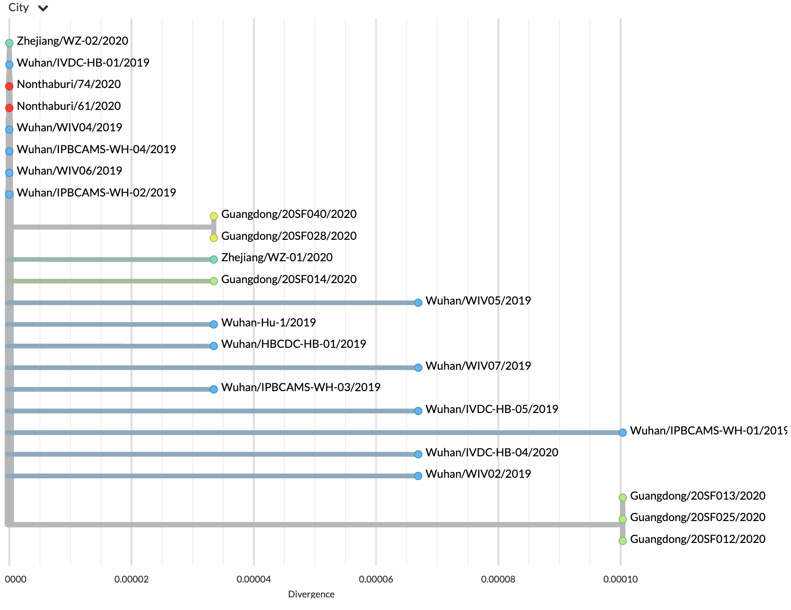
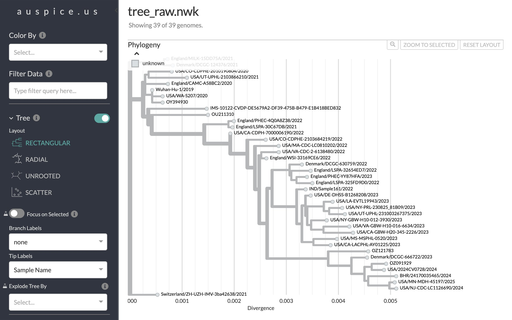
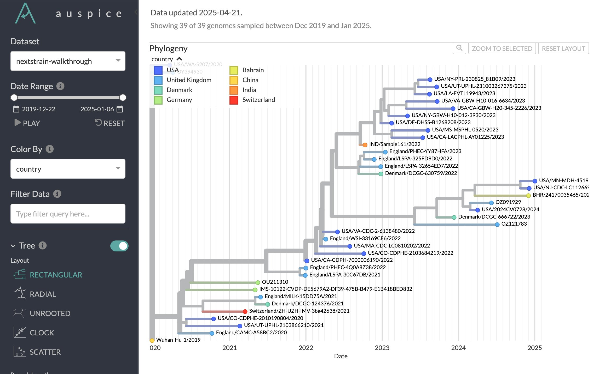
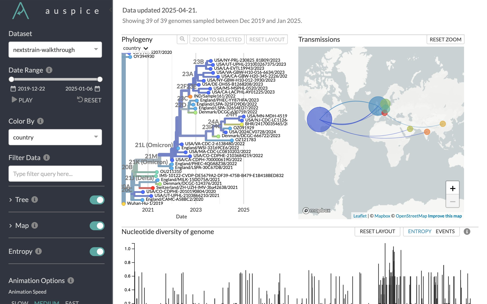
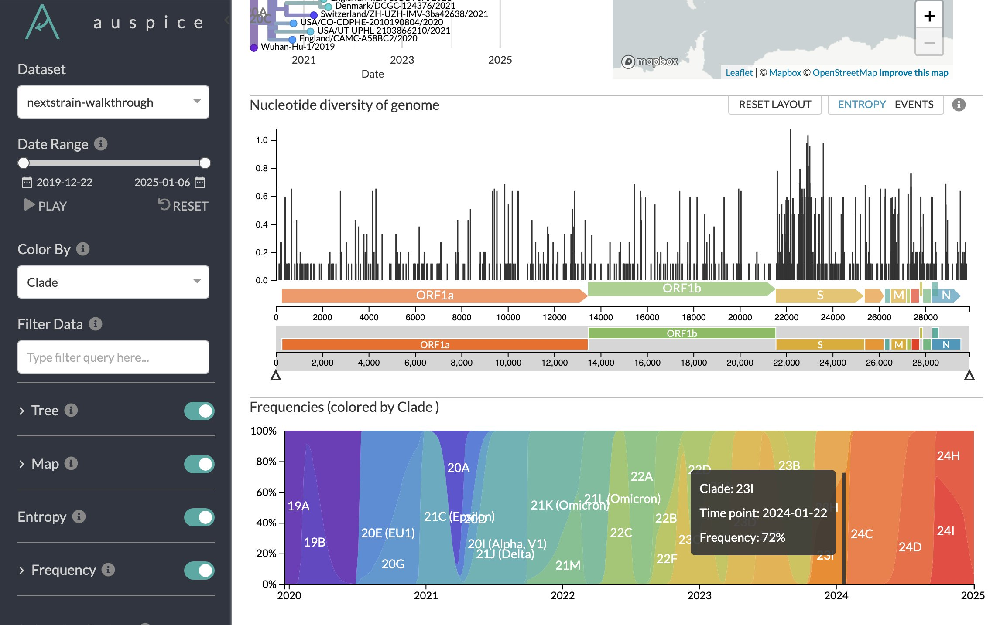

:orphan:

===========================================================
Nextstrain Walkthrough: From Sequence Data to Visualization
===========================================================

This walkthrough was originally written for use by our team to teach live workshops.
Content has been adjusted to be a generic tutorial.

.. contents:: Table of Contents
   :local:
   :depth: 1

Prerequisites
=============

Visit the `tutorial repository <https://docs.github.com/en/repositories/creating-and-managing-repositories/cloning-a-repository>`__ and follow setup instructions in the README.

Scope
=====

This tutorial focuses on the following topics to introduce the details of Nextstrain's genomic epidemiology tools:

-  specific file formats
-  command line instructions required to analyze a specific pathogen
-  instructions to visualize and interpret that pathogen's phylogeny in Auspice

This tutorial does not include discussions about:

-  installation of tools
-  data curation
-  workflow design

These topics are critical but outside the scope of a short tutorial on genomic epidemiology.

Learning objectives
===================

By the end of this tutorial, you will know how to:

-  identify the necessary input files to perform a genomic epidemiology analysis with Nextstrain
-  run commands in Nextstrain’s bioinformatics toolkit including Augur and Nextclade to convert input genomes and metadata into an annotated phylogenetic time tree that can be visualized locally or online
-  inspect and understand the contents of Nextstrain toolkit command outputs
-  visualize and interpret a phylogenetic tree produced by Nextstrain’s bioinformatics toolkit using `auspice.us <https://auspice.us>`__

Introduction
============

Why do we need real-time genomic epidemiology?
----------------------------------------------

At the beginning of the SARS-CoV-2 pandemic, we knew little about this specific new virus, but we did have previous knowledge from SARS-CoV-1 and MERS-CoV outbreaks and a handful of complete SARS-CoV-2 genomes and metadata.
Together, these data and previous knowledge allowed the Nextstrain team to prepare `a situation report documenting the state of the pandemic at its earliest stages <https://nextstrain.org/narratives/ncov/sit-rep/2020-01-23>`__.
`A phylogenetic tree with 24 genomes <https://nextstrain.org/narratives/ncov/sit-rep/2020-01-23?n=5>`__ strongly suggested that this new virus could transmit efficiently between humans and quickly across geographic regions.

`Genomic epidemiology enabled detection of community spread in the Seattle area early in the pandemic <https://nextstrain.org/narratives/ncov/sit-rep/2020-03-05?n=10>`__ before anyone was aware that SARS-CoV-2 was already so widespread in the community.
These tools have been a key component of New Zealand's pandemic response, as documented in `a Nextstrain narrative describing specific outbreaks in New Zealand <https://nextstrain.org/community/narratives/ESR-NZ/GenomicsNarrativeSARSCoV2/aotearoa-border-incursions>`__.

How do we use Nextstrain to perform genomic epidemiology analyses?
------------------------------------------------------------------

The process for creating a Nextstrain analysis generally requires the following steps.

1. Curate data.

   -  Collect genome sequences.
   -  Collect genome metadata.
   -  Prepare pathogen-specific configuration files and parameters (e.g., reference genomes, gene coordinates, clock rates, etc.).

2. Analyze data.

   -  Run commands manually or in a workflow.
   -  Run commands locally or in the cloud.
   -  Here, we will focus on how to run commands and understand their inputs and outputs.

3. Visualize and interpret analysis outputs.

   -  Run a local `Auspice <https://docs.nextstrain.org/projects/auspice/en/stable/>`__ server.
   -  Drag-and-drop onto `auspice.us <https://auspice.us>`__.
   -  Upload data to GitHub or Nextstrain Groups and view through `nextstrain.org <https://nextstrain.org>`__.

In this tutorial, you will learn how to analyze previously curated data and then visualize and interpret the resulting annotated phylogenetic tree.

Build an annotated time-scaled phylogeny of SARS-CoV-2
======================================================

Inspect input files
-------------------

To start, we will inspect the input files for SARS-CoV-2 analysis.
We will use a curated reference genome and annotations from Nextclade.
`See the data curation guide <data/README.md>`__ for more details.

Inspect the contents of the reference genome `FASTA <https://www.ncbi.nlm.nih.gov/genbank/fastaformat/>`__.

.. code:: bash

   head data/reference.fasta

Then, check out the gene map with genomic coordinates in `GFF format <https://github.com/The-Sequence-Ontology/Specifications/blob/master/gff3.md>`__.

.. code:: bash

   head data/genemap.gff

Next, inspect the genome sequences and metadata we have curated for this analysis.
These consist of two text files, one in `FASTA format <https://www.ncbi.nlm.nih.gov/genbank/fastaformat/>`__ and the other in a `tab-separated values (TSV) format <https://www.loc.gov/preservation/digital/formats/fdd/fdd000533.shtml>`__.
Genome sequences have:

-  One unique name per genome sequence that matches the name in the metadata.
-  One FASTA sequence per genome.

.. code:: bash

   head data/sequences.fasta

Note that Nextstrain also supports VCF files, as an alternate representation of sequences.

Genome metadata have:

-  One tab-delimited record per genome sequence with a "strain" name that matches the genome sequence name.
-  Required columns including "strain" and "date".
-  As many additional columns as you like.

.. code:: bash

   less -S data/metadata.tsv

To understand the evolutionary and epidemiological history of these samples, we need to:

1. select a representative set of high-quality samples
2. align their genomes
3. infer a phylogeny
4. infer a time-scaled phylogeny
5. infer ancestral sequences and traits
6. visualize the annotated phylogeny

Select high-quality data
------------------------

`Augur <https://docs.nextstrain.org/projects/augur/en/stable/index.html>`__ is a toolkit that we will use to prepare files for visualization.
We start by using ``augur filter`` to select a representative set of high-quality samples.
We determine the quality of the original data based on attributes of both the genome sequences and metadata.

Create a results directory to store our intermediate analysis outputs.

.. code:: bash

   mkdir results/

Look at available Augur subcommands.

.. code:: bash

   augur -h

Look at the help text for a specific Augur subcommand.

.. code:: bash

   augur filter -h

Use ``augur filter`` to eliminate low-quality or undesired data based on genome sequence or metadata attributes.
In the following command, we filter by sequence length.
We also force the inclusion of the reference genome that we will need for rooting the tree later.

.. code:: bash

   augur filter \
     --metadata data/metadata.tsv \
     --sequences data/sequences.fasta \
     --include config/include.txt \
     --min-length 27000 \
     --output-metadata results/filtered_metadata.tsv \
     --output-sequences results/filtered_sequences.fasta

When we list the results directory after running this command, we see the corresponding filtered metadata and sequences files.

.. code:: bash

   ls -l results/

Subsample data
--------------

After filtering for high-quality data, we often still have more samples than we can reasonably use to infer a phylogeny and we need to subsample our data.
Effective subsampling is a research topic of its own, but most commonly we try to sample evenly through time and space.
This approach attempts to account for sampling bias.
The following command uses ``augur filter`` again, this time to select at most 30 samples evenly across all countries and year/month combinations in the metadata.
We also force-include the reference genome required to root the tree later on.

.. code:: bash

   augur filter \
     --metadata results/filtered_metadata.tsv \
     --sequences results/filtered_sequences.fasta \
     --group-by country year month \
     --subsample-max-sequences 30 \
     --include config/include.txt \
     --output-metadata results/subsampled_metadata.tsv \
     --output-sequences results/subsampled_sequences.fasta

Align genomes
-------------

Next, we align the genome sequences of our subsampled data to a single reference genome.
This alignment ensures that all genomes have the same coordinates during tree inference.
Nextclade can produce both an alignment of the nucleotide sequences and amino acid alignments for all genes defined in a given gene map.
It can also produce comma-separated values (CSV) outputs including insertions relative to the reference genome and error messages per input genome.
The following command just performs the simplest alignment of the nucleotide sequences.

.. code:: bash

   nextclade run \
     --input-ref data/reference.fasta \
     --output-fasta results/aligned.fasta \
     results/subsampled_sequences.fasta

Infer a divergence tree
-----------------------

Infer a divergence tree from the alignment.
``augur tree`` is a lightweight wrapper around existing tree builders, providing some standardization of the input alignment and output across tools.
We use IQ-TREE by default, but other options include FastTree and RAxML.

   Note: All tree builders used by Augur are maximum-likelihood (ML) tools, enabling the "real-time" part of Nextstrain’s mission at the expense of the posterior and more sophisticated models available through Bayesian methods.
   The ML approach enables rapid prototyping to identify genomes to include in a more complex, longer-running Bayesian analysis.

.. code:: bash

   augur tree \
     --alignment results/aligned.fasta \
     --output results/tree_raw.nwk

We can view the divergence tree by loading ``results/tree_raw.nwk`` in `auspice.us <https://auspice.us/>`__.

You should see a view like this:

Let's familiarize ourselves with the Auspice interface.
The main view is an interactive phylogenetic tree.
To the left are controls for the main view.
There is not much going on with this particular visualization, because Newick files lack the additional data that powers most of the Auspice interface.

Drag and drop the ``results/subsampled_metadata.tsv`` onto the webpage.
This enables options to color by and filter on metadata attributes such as country.
It is an ad-hoc method that only applies to the tips of the tree, and goes away when you refresh the page.
Later steps will provide metadata directly with the tree, which enables more visualization features.

Infer a time tree
-----------------

With the alignment, the divergence tree, and the dates per sample from the metadata, we can infer a time-scaled phylogeny with estimated dates for internal nodes of the tree.
``augur refine`` is a lightweight wrapper around `TreeTime <https://github.com/neherlab/treetime>`__.
The following command roots the tree with the reference genome that we force-included earlier.

.. code:: bash

   augur refine \
     --alignment results/aligned.fasta \
     --tree results/tree_raw.nwk \
     --metadata results/subsampled_metadata.tsv \
     --timetree \
     --root "Wuhan-Hu-1/2019" \
     --output-tree results/tree.nwk \
     --output-node-data results/branch_lengths.json

This is the first step that produces a "node data JSON" output file.
We will see more of these in subsequent steps.
The node data JSON file is a Nextstrain-specific file standard that stores key/value attributes per node in the phylogenetic tree.
Example attributes include clock-scale branch lengths, inferred collection dates, and inferred nucleotide sequences for ancestral nodes.
Unlike the divergence tree builders, ``augur refine`` names internal nodes (e.g., NODE_0000000) so we can reference them in other downstream tools.

.. code:: bash

   less results/branch_lengths.json

We now have enough information to export the initial time tree and its metadata for visualization in Auspice.
This export step requires at least a Newick tree and a node data JSON file to produce ``nextstrain-walkthrough.json``, another Nextstrain-specific file standard that represents an Auspice dataset: the tree, its metadata, its node data, and details about how these data should all be visualized in Auspice.

.. code:: bash

   mkdir -p auspice/
   augur export v2 \
     --tree results/tree.nwk \
     --node-data results/branch_lengths.json \
     --metadata results/subsampled_metadata.tsv \
     --color-by-metadata country \
     --output auspice/nextstrain-walkthrough.json

..

View the new tree by loading ``auspice/nextstrain-walkthrough.json`` in `auspice.us <https://auspice.us/>`__.
It should look something like below.

   .. FIXME: update screenshot

Note the differences from the Auspice view of ``results/tree_raw.nwk``:

-  A time tree is shown. You can toggle between time and divergence in the control panel.
-  Location data has been added.

We can learn a lot from the tree and its metadata, but we don’t have any details about mutations on the tree, ancestral states, distances between sequences, clades, frequencies of clades through time, etc.
The next set of commands will produce these annotations on the tree in the format of additional node data JSONs.

Infer ancestral sequences and nucleotide mutations
--------------------------------------------------

One of the most important annotations for our analysis is the list of nucleotide and amino acid mutations per branch in the tree.
These annotations allow us to identify putative biologically-relevant mutations and also define clades like those for variants of concern.
To create these annotations, we need to infer the ancestral sequence for each internal node in the tree with ``augur ancestral``.
This subcommand is a lightweight wrapper around TreeTime that infers the most likely sequence per position in the given alignment for internal nodes in the given tree.

.. code:: bash

   augur ancestral \
     --tree results/tree.nwk \
     --alignment results/aligned.fasta \
     --output-node-data results/nt_muts.json

The node data JSON output contains inferred or observed sequences per node and inferred nucleotide mutations per node.
The output also contains the reference’s nucleotide sequence which gets used downstream.

.. code:: bash

   less -S results/nt_muts.json

Translate nucleotide mutations to amino acid mutations
------------------------------------------------------

We can translate these inferred and observed sequences with ``augur translate``, to identify all corresponding amino acid mutations per branch in the tree.

.. code:: bash

   augur translate \
     --tree results/tree.nwk \
     --ancestral-sequences results/nt_muts.json \
     --reference-sequence data/genemap.gff \
     --output-node-data results/aa_muts.json

The node data JSON output contains gene coordinates in an "annotations" key that will be used by Auspice later on to visualize mutations per gene.

.. code:: bash

   less -S results/aa_muts.json

Assign clade labels
-------------------

With these nucleotide and amino acid mutations per branch of the tree and a predefined list of mutations per clade, we can assign internal nodes and tips to clades.
We define clades in a TSV file with clade names associated with specific alleles that occur at specific sites.

.. code:: bash

   head config/clades.tsv

We can use this configuration file, the mutations, and tree to assign clades per internal node and tip.

.. code:: bash

   augur clades \
     --tree results/tree.nwk \
     --mutations results/nt_muts.json results/aa_muts.json \
     --clades config/clades.tsv \
     --output-node-data results/clades.json

The node data JSON contains a "clade_membership" key for each node in the tree.
Additionally, the first node in the tree for a given clade receives a "clade_annotation" key.
This second key is used to visualize clade names as branch labels in Auspice.

.. code:: bash

   less results/clades.json

Infer ancestral states for discrete traits
------------------------------------------

In a similar way that we infer the ancestral nucleotides for each node in the tree at each position of the alignment, we can infer the ancestral states for other discrete traits available in the metadata.
``augur traits`` is a lightweight wrapper around TreeTime that performs discrete trait analysis (DTA) on columns in the given metadata.
The command assigns the most likely ancestral states to named internal nodes and tips missing values for those states (i.e., samples for which metadata columns contain "?" values) and optionally produces confidence values per possible state.
The following command infers ancestral country with confidence values.

.. code:: bash

   augur traits \
     --tree results/tree.nwk \
     --metadata results/subsampled_metadata.tsv \
     --columns country \
     --confidence \
     --output-node-data results/traits.json

Inspect the resulting node data JSON output.
Note that this output also contains the inferred transition matrix and equilibrium probabilities for each requested column.

.. code:: bash

   less results/traits.json

Export files into an Auspice JSON
---------------------------------

We now have enough information to investigate mutations in the tree, which geographic locations those mutations might have first appeared in, and how those mutations correspond to known clades in the tree.
We can export these into the Auspice JSON file that Auspice will use to visualize the tree and its annotations.

.. code:: bash

   augur export v2 \
     --tree results/tree.nwk \
     --node-data results/branch_lengths.json \
                 results/nt_muts.json \
                 results/aa_muts.json \
                 results/clades.json \
                 results/traits.json \
     --metadata results/subsampled_metadata.tsv \
     --color-by-metadata country \
     --geo-resolutions country \
     --output auspice/nextstrain-walkthrough.json

View the updated tree by loading ``auspice/nextstrain-walkthrough.json`` in `auspice.us <https://auspice.us/>`__.
It should look something like below.

Note the differences from the previous Auspice dataset:

-  Clade labels have been added.
-  Country has been inferred for internal nodes.
-  Hovering over tips and branches shows mutation information.
-  There are two new panels, **Map** and **Entropy**.

Visualize and interpret a SARS-CoV-2 phylogeny
==============================================

   Note that while the following instructions describe a specific Nextstrain analysis, the same general steps will apply to any pathogen tree.

See also, `the example SARS-CoV-2 tree produced by the analysis above <https://nextstrain.org/community/nextstrain/nextstrain-walkthrough/example-ncov>`__.

Review the Auspice layout
-------------------------

Open `the Nextstrain build for SARS-CoV-2 in Africa as of September 2021 <https://nextstrain.org/ncov/gisaid/africa/2021-09-03>`__ and note layout of Auspice:

-  Control panel on left
-  Main panel on right

   -  Tree
   -  Map
   -  Diversity (or "Entropy")
   -  Frequencies
   -  Description
   -  Filter lists
   -  Metadata and downloads

Modify layout
-------------

`Enable the grid view <https://nextstrain.org/ncov/gisaid/africa/2021-09-03?p=grid>`__.
Reset zoom on the map, as needed.
Note how the URL changes in response to interactions with Nextstrain.
Saving state in the URL allows us to capture specific, detailed views for loading again later.
You can share this URL to send the same view to anyone else.

Filter data
-----------

`Filter the tree to just data from Africa <https://nextstrain.org/ncov/gisaid/africa/2021-09-03?f_region=Africa&p=grid>`__.
Note the appearance of the counts of total genomes shown and "Filtered to" section at the top of the main panel.
Filters act on tips and affect all panels:

-  The tree hides filtered tips.
-  The map resets its zoom to geographic positions of tips remaining in tree.
-  The diversity panel shows only mutations for remaining tips.
-  The frequencies panel normalizes frequencies to sum to 100% for remaining tips.

Toggle filters with "eye" icons at the top of the main panel or below "Filter Data" section of the navigation panel.
Remove filters with the "trash can" icons at the top of the main panel or below the "Filter Data" section.

Curate a view of your data
--------------------------

We often need to communicate evolutionary patterns from genomic data in the context of time and geographic location.
For example, we may want to understand how mutations at Spike (S) 681 emerged and transmitted across a specific country or region of Africa.

Most Nextstrain panels can communicate a subset of genotypic, geographic, and temporal information.
The tree shows genotype through phylogenetic structure, time on the x-axis, and geography by color.
The map shows genotype by color and geography on the x- and y-axes, but it does not communicate time.
The frequency panel shows genotype by color and time along the x-axis, but it does not communicate geography.

How can we effectively show the evolution site S:681 through space and time?

`Color by genotype using grid view with time tree on the left and map on the right, and frequencies enabled <https://nextstrain.org/ncov/gisaid/africa/2021-09-03?c=gt-S_681&d=tree,map,entropy,frequencies&f_region=Africa&p=grid>`__.
To color by genotype, either a) find site 681 in the S gene in the entropy panel and click the corresponding bar, or b) select "Genotype" from the "Color By" menu on the left navigation, select "S", and enter 681 to the site field.
The map still represents all time points.
This view shows the global perspective of this site's evolution, but we cannot tell how these changes occurred through time in a specific country.

`Turn off the entropy panel <https://nextstrain.org/ncov/gisaid/africa/2021-09-03?c=gt-S_681&d=tree,map,frequencies&f_region=Africa&p=grid>`__, so we can focus on the tree, map, and frequencies.

`Filter to Kenya and set "geographic resolution" to "division" <https://nextstrain.org/ncov/gisaid/africa/2021-09-03?c=gt-S_681&d=tree,map,frequencies&f_country=Kenya&f_region=Africa&p=grid&r=division>`__.
Reset zoom on map, as needed.
In this view, information about timing of these genotypes is more effectively communicated by the frequencies panel than the tree.
Note the additional "Filtered to" section with logical "and" between the existing "Africa" filter and the new "Kenya" filter.

`Turn off the tree, keeping only the map and the frequencies panel <https://nextstrain.org/ncov/gisaid/africa/2021-09-03?c=gt-S_681&d=map,frequencies&f_country=Kenya&f_region=Africa&p=full&r=division>`__.
Now, we see the dynamics of S:681 mutations across divisions in Kenya and through time.
The map still represents counts for all time points, so we have to imagine the waves of genotypes 681H and 681R taking place at the geographic level.

`To understand the geographic distribution of recent strains in Kenya, drag the left handle of the date slider to early June 2021 <https://nextstrain.org/ncov/gisaid/africa/2021-09-03?c=gt-S_681&d=map,frequencies&dmin=2021-06-01&f_country=Kenya&f_region=Africa&p=full&r=division>`__ or enter "06 / 01 / 2021" after first clicking on the start date below the slider.
This filters the data to the most recent strains, revealing a couple of dozen cases that appear to map in the middle of Kenya.

`Doublecheck the resolution of geographic information by coloring the map by "Admin Division" <https://nextstrain.org/ncov/gisaid/africa/2021-09-03?c=division&d=map,frequencies&dmin=2021-06-05&f_country=Kenya&f_region=Africa&p=full&r=division>`__.
This view reveals that we actually don't have division-level information for these recent strains.
`"Reset" the date filter to confirm that many strains do have division-level information <https://nextstrain.org/ncov/gisaid/africa/2021-09-03?c=division&d=map,frequencies&f_country=Kenya&f_region=Africa&p=full&r=division>`__.

`Color by genotype at S:681 again and drag the date slider from the right handle back to the beginning of 2020 <https://nextstrain.org/ncov/gisaid/africa/2021-09-03?c=gt-S_681&d=map,frequencies&dmax=2020-02-01&f_country=Kenya&f_region=Africa&p=full&r=division>`__ or enter "02 / 01 / 2020" after first clicking on the end date below the slider.
Then, drag the left handle of the slider slowly to the right and watch the map.
This view allows you to filter the strains by time on the map view, showing when and where cases of a specific genotype first emerged.
This requires manual intervention with Nextstrain.

`"Reset" the date filter, turn off the frequencies panel, and then click the "Play" button to animate the timing of S:681 genotypes on the map <https://nextstrain.org/ncov/gisaid/africa/2021-09-03?animate=2019-12-06,2021-08-28,0,0,30000&c=gt-S_681&d=map&f_country=Kenya&f_region=Africa&p=full&r=division>`__.

`Inspect regional patterns in neighboring divisions by filtering data to Kilifi, Kwale, and Mombasa. Select "Play" from the date controls again to watch the evolution of S:681 genotypes in this region <https://nextstrain.org/ncov/gisaid/africa/2021-09-03?animate=2019-12-06,2021-08-28,0,0,30000&c=gt-S_681&d=map&f_country=Kenya&f_division=Kilifi,Mombasa,Kwale&f_region=Africa&p=full&r=division&transmissions=show>`__.

`"Reset" the date filter, turn on the tree, turn off the map, and select the "Scatter" tree layout <https://nextstrain.org/ncov/gisaid/africa/2021-09-03?branches=hide&c=gt-S_681&d=tree&f_country=Kenya&f_division=Kilifi,Mombasa,Kwale&f_region=Africa&l=scatter&p=full&r=division&scatterY=gt&transmissions=show>`__.
This view also clearly quantifies the transmission of S:681 genotypes through time with time on the x-axis, the genotype on the y-axis and color.
Toggle off the button for "Show branches" below the "Scatter" section of the navigation panel, to focus on the observed genomes.
There are benefits and disadvantages to each of these views, depending on the question you want to answer or the pattern you want to communicate.

Explore recent data for your country of interest
------------------------------------------------

`Navigate to the most recent global SARS-CoV-2 analysis <https://nextstrain.org/ncov/gisaid/global/6m>`__.
Filter the tree to samples from your country of interest.
Which clades have been circulating in that country in the last 6 months?

Change the map's geographic resolution to "division".
Which divisions (or states) appear to have the most samples?
Do all divisions have similar clade compositions?

Zoom into the spike gene "S" in the diversity/entropy panel and select the bar for one of the highest entropy positions in the gene.
Looking at the tree, do the mutations at this site appear only once in the tree or multiple times?
Looking at the map, are there any divisions in the country that experience different genotypes?
Looking at the frequencies panel, which genotypes appear to be most successful recently?

Next steps
==========

-  Work through additional exercises listed below
-  `Work through our guide to genomic epidemiology of SARS-CoV-2 <https://docs.nextstrain.org/projects/ncov/en/latest/index.html>`__.
-  `Learn how to convert a series of shell commands into a Nextstrain workflow with Snakemake <https://github.com/huddlej/example-nextstrain-workflow>`__.
-  `Learn how to communicate results from genomic epidemiology analyses through Nextstrain Narratives <https://www.youtube.com/playlist?list=PLsFWZl6SQqWxN9SkbgdjU8sylIfhZNDiW>`__.
-  Get involved by `asking questions on our discussion site <https://discussion.nextstrain.org/>`__, `reaching out by email at hello@nextstrain.org <hello@nextstrain.org>`__, or `contributing to Nextstrain <https://docs.nextstrain.org/en/latest/guides/contribute/index.html>`__.
-  Ask about joining Nextstrain office hours at `hello@nextstrain.org <hello@nextstrain.org>`__.

Additional exercises
====================

Analyze sequences with Nextclade
--------------------------------

.. tip::

   For a more in-depth guide, visit `Nextclade Web documentation <https://docs.nextstrain.org/projects/nextclade/en/stable/user/nextclade-web/index.html>`__.

The Nextclade CLI that we used briefly at the beginning of the tutorial has a graphical counterpart that runs entirely in your web browser.

Visit the `Nextclade website <https://clades.nextstrain.org>`__ and load ``results/subsampled_sequences.fasta`` as the input file.
A SARS-CoV-2 reference dataset will be automatically suggested.
Click **Run**.

Nextclade analyzes each sequence, showing results as they are completed in a tabular format.
Some values can be hovered to show detailed information.

Click **Tree** at the top to go to the next page.
A simplified Auspice view is shown with just the Tree and Entropy panels.
Note that the tree is backed by a predefined Nextclade reference dataset and your input sequences, pre-filtered to the latter.

The final **Export** page has options to download various output files.

.. note::

   There are only a handful of Nextclade datasets available, but the Nextstrain team and other scientific community members are actively expanding the selection.

Estimate frequencies of data through time
-----------------------------------------

In addition to the annotated tree, we often want to know how frequencies of mutations, clades, or other traits change over time.
We can estimate these frequencies with ``augur frequencies``.
This subcommand assigns a KDE kernel to each tip in the given tree centered on the collection date for the tip in the given metadata.
The command sums and normalizes the KDE values across all tips and at each timepoint ("pivot") such that frequencies equal 1 at all timepoints.
The following command estimates frequencies from the subsampled data at weekly timepoints with a KDE bandwidth of approximately 2 weeks (measured in years).

.. code:: bash

   augur frequencies \
     --metadata results/subsampled_metadata.tsv \
     --tree results/tree.nwk \
     --method kde \
     --pivot-interval 1 \
     --pivot-interval-units weeks \
     --narrow-bandwidth 0.041 \
     --proportion-wide 0.0 \
     --output auspice/nextstrain-walkthrough_tip-frequencies.json

The output JSON file is an Auspice "`sidecar JSON <https://docs.nextstrain.org/en/latest/reference/data-formats.html>`__" that Auspice knows how to load for a given main Auspice JSON based on its filename.
We need to tell Auspice to expect this sidecar file when it loads the tree, so we need to modify the ``augur export v2`` command we used early to include the following argument that tells Auspice which panels to display:

.. code:: bash

   augur export v2 \
     --tree results/tree.nwk \
     --node-data results/branch_lengths.json \
                 results/nt_muts.json \
                 results/aa_muts.json \
                 results/clades.json \
                 results/traits.json \
     --metadata results/subsampled_metadata.tsv \
     --color-by-metadata country \
     --geo-resolutions country \
     --output auspice/nextstrain-walkthrough.json \
     --panels tree map entropy frequencies

View the updated tree by loading **both** ``auspice/nextstrain-walkthrough.json`` and ``auspice/nextstrain-walkthrough_tip-frequencies.json`` in `auspice.us <https://auspice.us>`__.

A new panel is available, **Frequencies**. Color by **Clade** to see the dominance of clades over time.

